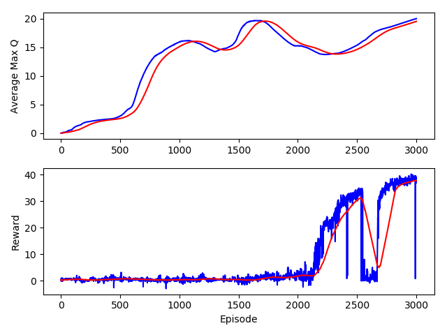
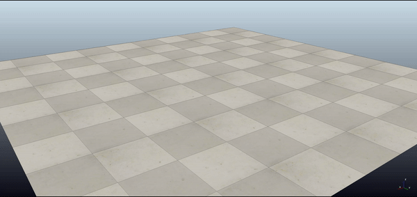
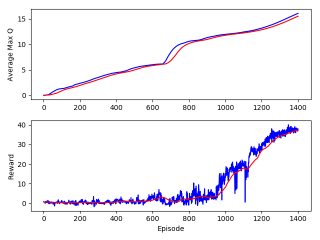
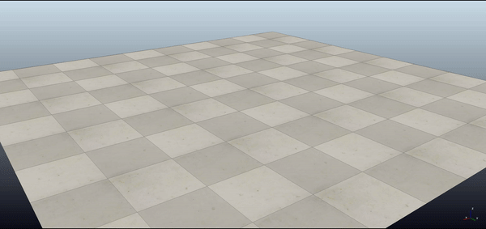
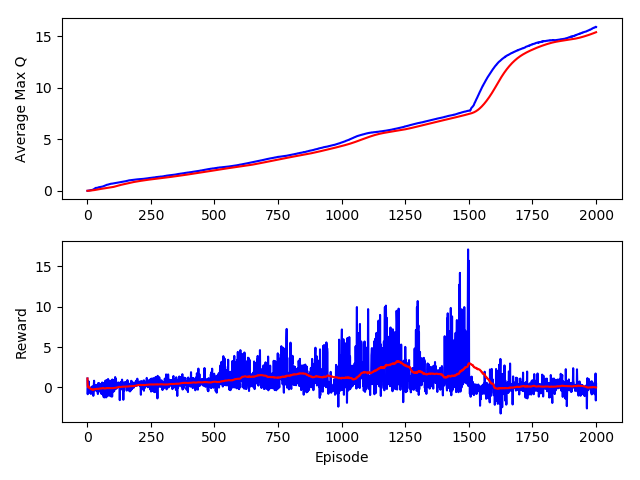
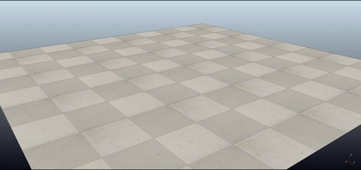

# Learning to Walk

Learning hexapod walking movement using Deep Deterministic Policy Gradient (DDPG).


## Table of Contents

* [Installation](#installation)
* [Running the Model](#running-the-model)
* [Results](#results)

## Installation

Download and install [V-REP](http://www.coppeliarobotics.com/).

Download and install [Anaconda](https://www.anaconda.com/).

From the Anaconda Prompt:
```bash
conda env create -f environment.yml
conda activate env rcunning-project
```

## Running the Model

The following command will train the hexapod using the default parameters and store the learned model in the `./results/<new name>` directory.

```bash
python -m src.main --ckpt_dir=<new name> --num_episodes=3000 --train
``` 

To test a learned model in the `./results/<new name>` directory and view the robot walking use the following command.

```bash
python -m src.main --ckpt_dir=<new name> --num_episodes=5 --test --render
```

View all command options with the following command.

```bash
python -m src.main --help
```

## Results

Full details on the algorithm and results can be found in the [report](report.pdf).

- Robot starting orientation constrained to [-30&deg;, 30&deg;] without demonstrations:

```bash
python -m src.main --ckpt_dir=60_degrees --num_episodes=5 --test --render
```




- Robot starting orientation constrained to [-30&deg;, 30&deg;] with demonstrations:

```bash
python -m src.main --ckpt_dir=demo_60_degrees --num_episodes=5 --test --render
```





- Robot starting orientation unconstrained ([-180&deg;, 180&deg;]) with demonstrations:

```bash
python -m src.main --ckpt_dir=demo_360_degrees --num_episodes=5 --test --render
```






